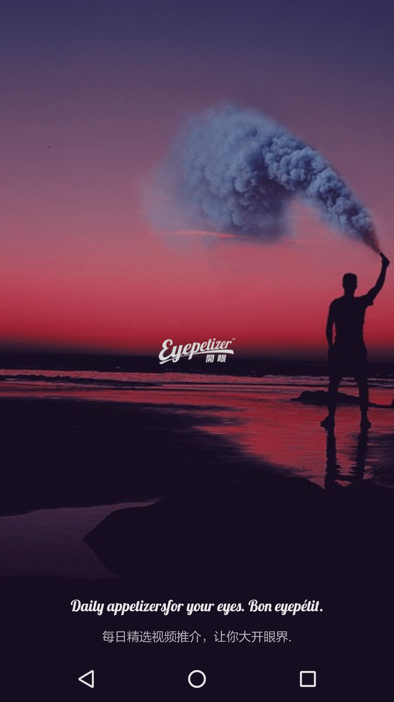
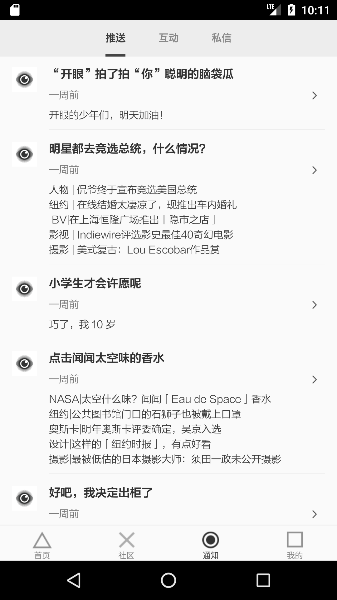
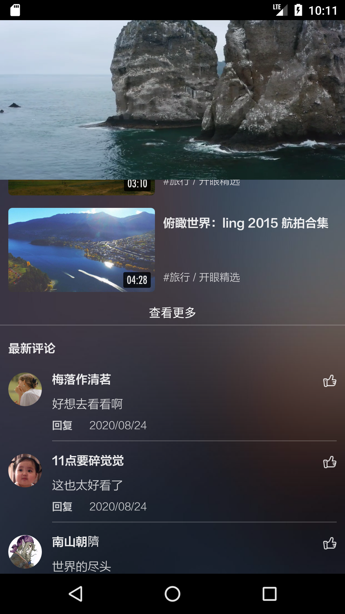

# eyepetizer-kotlin

仿开眼app的练习项目，主要为了练习MVVM + DataBinding + LiveData + 组件化 + kotlin等的使用

[点我下载](https://github.com/drkingwater/eyepetizer-kotlin/raw/master/release/eyepetizer_v1.1.0.apk)

### 应用截图

|            |  |  |
| ------------------------------------------------------------ | --------------------------------------------------- | -------------------------------------------------- |
|            |   |  |
|  |                                                     |                                                     |

### 已实现功能

- 首页、社区、通知内容展示
- 视频详情页、视频播放、评论展示
- 其他...

### 待实现功能

- 视频播放封装+全屏
- 图片详情页
- 网页加载
- 其他...

### 技能
- MVVM + DataBinding + LiveData
- kotlin作为主要开发语言
- 组件化开发，利用launch模块单独调试各个module，防止切换app/module时反复进行同步
- Retrofit + 协程完成网络请求

### 声明

> 该项目所用api均来源于开眼官方，仅供学习交流使用，不可用于商业用途。

未完待续...

